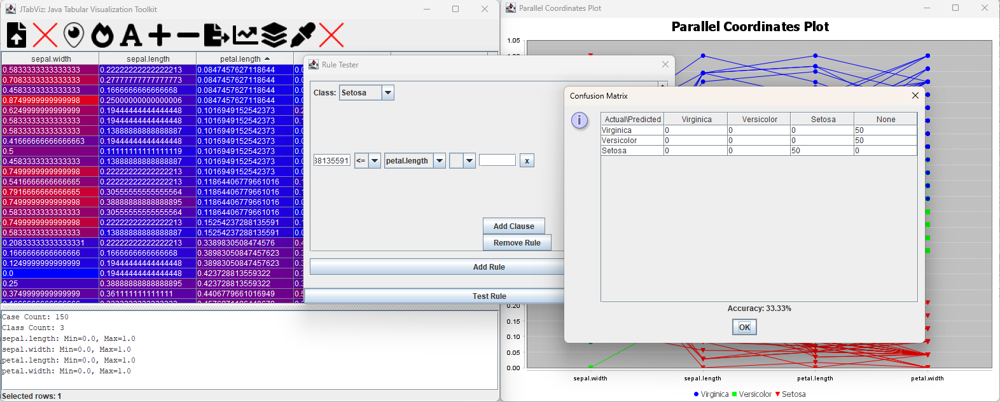

# JTabViz: Java Tabular Visualization Toolkit

**JTabViz** is a Java-based machine learning data analysis toolkit. It supports loading, viewing, analyzing, and classifying CSV data. Key features include data normalization, visualization (heatmaps, Parallel Coordinates, Shifted Paired Coordinates, Static Circular Coordinates), row manipulation, rules testing, analytical rule discovery automation, and data export.

Demo: Exploring Fisher Iris data. Highlighting sepal width outliers for Virginica class.


Shifted Paired Coordinates Demo highlighting a potential misclassification in the Virginica class based on sepal width.


Static Circular Coordinates Demo highlighting a petal length outlier in the Virginica class.


Combined View Demo.


Outlier in Setosa sepal width attribute highlighted.


Rules Tester Demo.


Classifying Fisher Iris data with a single attribute for 75% of dataset.


## Features

- Load and display CSV data
- Normalize numerical columns
- Highlight missing data
- Visualize data as heatmap, Parallel Coordinates (PC), Shifted Paired Coordinates (SPC), and Static Circular Coordinates (SCC)
- Manipulate rows (insert, delete, clone, reorder)
- Customize font color and highlight class fields
- Export modified data to CSV
- Test and save classification rules
- Multi-row selection and reordering
- Copy cell content (Ctrl+C)
- Highlight selected rows in PC and SPC views
- Analytical single attribute rule discovery algorithm
- Case classifiable with single pure attribute intervals hideable
- Hidden classified cases no longer clutter visualizations for analysis of difficult to classify regions with single attribute approach.
- Default threshold position work in progress

## Classifying with Single Attribute Pure Intervals

JTabViz automatically identifies and utilizes pure intervals within individual attributes to classify data points. A pure interval is a range within a single attribute where all data points belong to the same class. This approach allows for straightforward and interpretable classification rules based on specific attribute values.

## Getting Started

There are three ways to run JTabViz:

1. Using the pre-compiled JAR file:
   - Download the `JTabViz.jar` file and the `libs` folder.
   - Open a terminal and navigate to the directory containing the JAR file.
   - Run the following command:

     ```sh
     java -cp ".;libs/*;JTabViz.jar" src.Main
     ```

2. Compiling and running from source:
   - Clone the repository:

     ```sh
     git clone https://github.com/AvaAvarai/jtabviz.git
     ```

   - Navigate to the project directory.
   - Compile the project:

     ```sh
     javac -cp ".;libs/*" src/Main.java
     ```

   - Run the compiled project:

     ```sh
     java -cp ".;libs/*" src/Main
     ```

3. Creating and running your own JAR file:
   - Follow steps 1 and 2 of the "Compiling and running from source" method.
   - Create a JAR file:

     ```sh
     jar cfm JTabViz.jar MANIFEST.MF -C out .
     ```

   - Run the created JAR file:

     ```sh
     java -cp ".;libs/*;JTabViz.jar" src.Main
     ```

Note: Replace `;` with `:` in the classpath (-cp) if you're using a Unix-based system (Linux, macOS).

## Data Format

JTabViz accepts data in CSV (Comma-Separated Values) format. Here are the key points about the expected data format:

1. File Extension: The data file should have a .csv extension.

2. Data Types:
   - Numerical data is preferred for optimal visualization and analysis.
   - Non-numerical data and blank fields are also accepted.

3. Class Column:
   - A column representing the class or category of each data point is expected.
   - This column should be titled "class" (case-insensitive, so "Class" or "CLASS" are also acceptable).
   - The class column is used for color-coding and shape assignment in various visualizations.

4. Header Row:
   - The first row of the CSV file should contain column names.

5. Delimiter:
   - Values should be separated by commas.

Example CSV structure:

| x1    | x2    | x3    | x4    | x5    | class |
|-------|-------|-------|-------|-------|-------|
| 3.14  | 2.71  | 1.41  | 0.58  | 1.73  | A     |
| 2.22  | 4.44  | 3.33  | 1.11  | 5.55  | B     |
| 0.87  | 1.23  | 3.45  | 5.67  | 7.89  | A     |
| 9.99  | 8.88  | 7.77  | 6.66  | 5.55  | C     |
| 1.23  | 4.56  | 7.89  | 2.34  | 5.67  | B     |

## Aknowledgements

The user interface icons used are source from Font Awesome.

## License

The software is freely available for personal and commerical use under the MIT license see `LICENSE` for full details.
