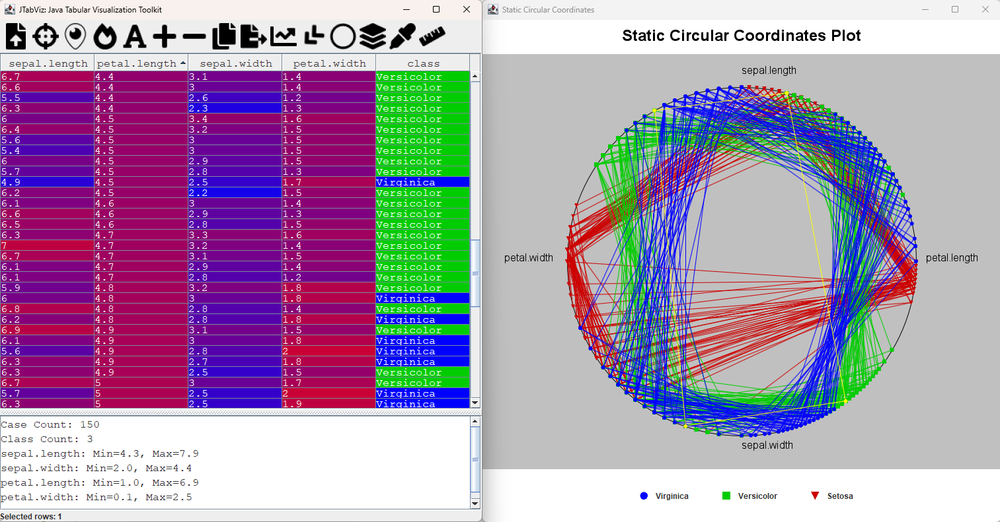
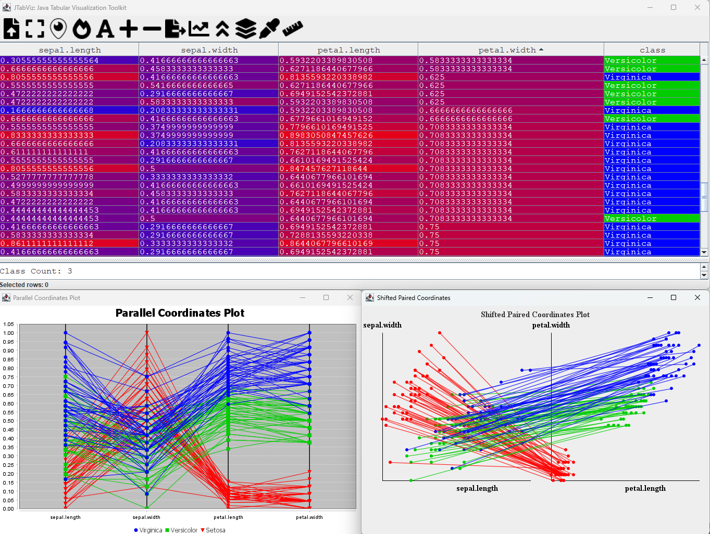
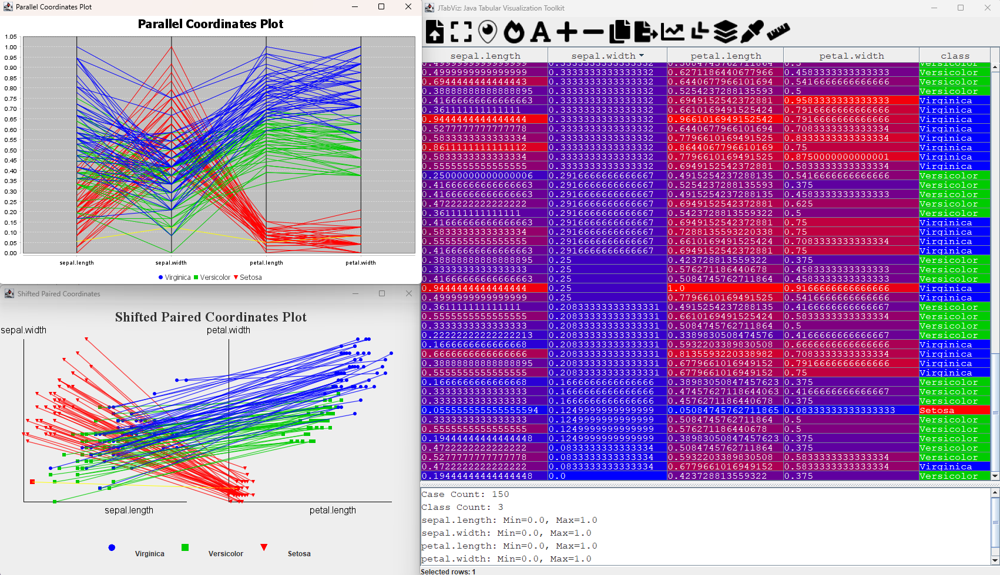

# JTabViz: Java Tabular Visualization Toolkit

**JTabViz** is a Java-based machine learning data analysis toolkit. It supports loading, viewing, analyzing, and classifying CSV data. Key features include data normalization, visualization (heatmaps, Parallel Coordinates, Shifted Paired Coordinates, Static Circular Coordinates), row manipulation, rules testing, and data export.

Demo: Exploring Fisher Iris Data. Highlighting sepal width outliers for Virginica class.


Shifted Paired Coordinates Demo highlighting a potential misclassification in the Virginica class based on sepal width.


Static Circular Coordinates Demo highlighting a petal length outlier in the Virginica class.


Combined View Demo.


Outlier in Setosa sepal width attribute highlighted.


Rules Tester Demo.


## Features

- Load and display CSV data
- Normalize numerical columns
- Highlight missing data
- Visualize data as heatmap, Parallel Coordinates (PC), Shifted Paired Coordinates (SPC), and Static Circular Coordinates (SCC)
- Manipulate rows (insert, delete, clone, reorder)
- Customize font color and highlight class fields
- Export modified data to CSV
- Test and save classification rules
- Multi-row selection and reordering
- Copy cell content (Ctrl+C)
- Highlight selected rows in PC and SPC views

## Getting Started

There are three ways to run JTabViz:

1. Using the pre-compiled JAR file:
   - Download the `JTabViz.jar` file and the `libs` folder.
   - Open a terminal and navigate to the directory containing the JAR file.
   - Run the following command:

     ```sh
     java -cp ".;libs/*;JTabViz.jar" src.CsvViewer
     ```

2. Compiling and running from source:
   - Clone the repository:

     ```sh
     git clone https://github.com/AvaAvarai/jtabviz.git
     ```

   - Navigate to the project directory.
   - Compile the project:

     ```sh
     javac -cp ".;libs/*" src/CsvViewer.java
     ```

   - Run the compiled project:

     ```sh
     java -cp ".;libs/*" src/CsvViewer
     ```

3. Creating and running your own JAR file:
   - Follow steps 1 and 2 of the "Compiling and running from source" method.
   - Create a JAR file:

     ```sh
     jar cfm JTabViz.jar MANIFEST.MF -C out .
     ```

   - Run the created JAR file:

     ```sh
     java -cp ".;libs/*;JTabViz.jar" src.CsvViewer
     ```

Note: Replace `;` with `:` in the classpath (-cp) if you're using a Unix-based system (Linux, macOS).

## Data Format

Data used should be stored in a .csv file, ideally numerical, however, this software should accept blank fields. The label column should be titled `class`, case-insensitive.

## Aknowledgements

The user interface icons used are source from Font Awesome.

## License

The software is freely available for personal and commerical use under the MIT license see `LICENSE` for full details.
